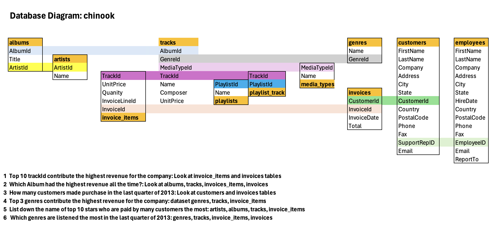

## [SQL] Chinook Music Analysis

### The Objectives:
Based on the list of discrete datasets to figure out the insights
- market performance and trends
- customer's demographic
- sale agents' performance

### Database
[Click here to download the database](https://cdn.fs.teachablecdn.com/dRmwOLQsS22FVFbXfh3x))

### The Database Diagram
The chinook database has 11 tables in it. You can visualize how the tables are related to each other in this diagram

How to understand this database diagram

- employees table stores employees data such as employee id, last name, first name, etc. It also has a field named ReportsTo to specify who reports to whom.
- customers table stores customers data. The line between employees.Employeeid and customers.SupportRepID shows how the two tables are related (ie, how you would JOIN them).
- The invoices table stores invoice header data (Customer ID, Billing Address, etc) and the invoice_items table stores the invoice line items data (Unit Price, Quantity).
- artists table stores artists data.
- albums table stores data about a list of tracks. Each album belongs to one artist. However, one artist may have multiple albums.
- media_types table stores media types such as MPEG audio and AAC audio files.
- genres table stores music types such as rock, jazz, metal, etc.
- tracks table stores the data of songs. Each track belongs to one album.
- playlists table store data about playlists. Each playlist contains a list of tracks. Each track may belong to multiple playlists. The relationship between the playlists table and tracks table is many-to-many. The playlist_track table is used to reflect this relationship.

## The analysis
In this case study, I focus on using as many as posible the SQL syntax that I have learned, including
- Basic commands: SELECT, FROM, WHERE
- Aggregating and window functions
- JOIN & COMBINE tables
- Subqueries Function with CTE and CREATE TEMPORARY TABLE
- Remark Statements with CASE

